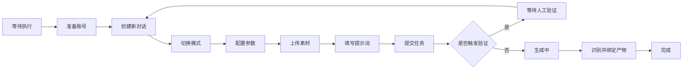

# 豆包工作室 Doubao Studio

[](https://github.com/dorakoo/doubao-studio/releases)
[](https://www.electronjs.org/)
[](https://react.dev/)
[](https://www.typescriptlang.org/)
[](LICENSE)

豆包工作室是一款面向 AI 内容创作者的 Windows 桌面工作台。它在一个应用中管理多个独立豆包账号，并将提示词、参考素材、视频参数、任务调度、生成等待、产物提取和批量下载串成可追踪、可暂停、可恢复的生产流程。

项目重点不是替代豆包网页，而是在保留原始网页操作能力的同时，为重复生产工作增加任务队列、多账号隔离、状态记录和产物管理。

从 v2.0 开始，工作台以“项目”为一级组织单位。每个项目拥有独立的任务、CSV 批次、运行历史和产物视图，适合同时管理多个内容主题或客户交付。

> 本项目是社区开发的非官方工具，与字节跳动或豆包官方无隶属关系。使用时请遵守豆包服务条款、内容规范和所在地法律法规。

## 最新工作流改进

- 视频任务在提交前会精确校验模型、时长和画面比例；任一配置未成功写入页面时，任务会停止而不是以错误参数继续提交。
- 全局暂停后的任务会清理遗留运行锁并重新进入队列。恢复失败时会显示具体原因，避免出现界面已恢复但调度器没有动作的情况。
- 浏览器工具栏提供“提取当前对话视频”按钮：对手动在豆包网页中生成的视频，尝试解析平台提供的原始媒体地址并直接下载，同时更新对应账号的 Seedance 预计额度。
- 任务超时后仍可从任务条目手动提取视频；人工补提取成功会补记额度，重复提取已完成任务不会重复扣减。
- 视频地址提取优先使用平台下载信息、播放信息和结构化会话数据。只有平台返回可验证的原始媒体地址时才会下载原始文件；无法确认时会明确提示，不把普通播放地址误报为无水印文件。

## 核心能力

### 项目化工作空间

- 顶部项目切换器用于创建和切换项目。
- 旧版本任务自动迁移到“默认项目”。
- 任务列表、CSV 批次和产物中心按当前项目隔离。
- 项目概览显示完成率、任务数、批次数和历史产物。
- 支持导出不含网页登录信息和远程产物地址的项目包。

### 多账号工作区

- 每个账号使用独立 Electron Session，隔离 Cookie、登录状态和网页存储。
- 支持账号置顶、搜索、刷新、运行状态和健康状态展示。
- 根据任务负载、连续失败、冷却状态和 Seedance 预测额度智能分配账号。
- 检测额度耗尽、人工验证和登录异常后自动降低账号调度优先级。
- 支持暂停账号调度和手动冷却 30 分钟。
- 不可用账号上的排队任务可迁移到其他健康账号。

### 多模式任务生产

- 支持对话、图片、视频和音乐任务。
- 视频任务支持 Seedance 2.0、Fast、Mini，及常用画面比例和时长。
- 支持多张参考图片、参考音频和完整配置编辑重跑。
- 每次启动或重跑任务前创建新对话，减少不同任务之间的上下文污染。
- 可保存完整任务模板，复用提示词、模式、素材和视频配置。

### 批量变量

提示词中可以使用 `{{变量名}}`，变量区每行表示一组任务：

```text
一支 {{产品}} 放在 {{场景}}，电影感产品广告，柔和自然光
```

```text
产品=保温杯;场景=客厅
产品=咖啡杯;场景=办公室
```

添加后会生成两条独立任务。多个基础提示词仍可使用 `%%%%%%%%%%` 分隔。

### 可恢复自动化

任务不再只有简单的“运行中”。系统会持久化以下阶段：



- 保存运行 ID、输入快照、运行次数、当前阶段、阶段说明和心跳时间。
- 可立即暂停长时间视频等待，不必等到超时。
- 程序意外退出后，未完成任务会恢复为“已暂停”，可重新执行。
- 人工验证完成后会重新创建对话、上传素材并再次提交。
- 对额度、会员、人脸素材、审核、网络、页面变化和产物缺失进行分类记录。
- 主进程使用原子任务锁，阻止重复点击、热更新和竞态造成重复执行。
- 最近 20 次运行记录保留结果、错误类型和实际耗时。

### 视频生成与 15 秒模式

- 自动确认模型、比例和时长，减少下拉菜单选择失败。
- 15 秒视频通过可控制的请求补丁实现，自动任务和手动网页操作均可使用。
- 视频生成可以长时间等待，同时支持随时暂停和手动提取。
- 识别明确的额度不足、会员限制、人脸限制和生成失败提示，停止无意义等待。

> 15 秒模式依赖豆包当前网页请求结构，豆包更新后可能需要同步适配。

### 产物与下载

- 产物绑定任务运行 ID、账号、豆包对话地址、发现时间和来源。
- 重新运行不会删除历史产物记录。
- 手动提取旧任务时，会先打开该任务对应的豆包对话，避免抓取其他任务的视频。
- 下载任务保留完成状态、文件大小、失败原因和保存位置。
- 下载失败项可以在“下载记录”中重试。
- 视频原始地址提取采用多通道候选检测，但不保证任何时候都能获得无水印版本。

### 产物中心

- 汇总所有任务历次运行产生的图片、视频和文件。
- 按提示词、任务 ID、类型和地址有效性筛选。
- 对远程地址执行轻量有效性检测，区分有效、过期和不可用。
- 显示产物是否已经下载到本地。
- 支持预览、重新下载和返回产物对应的豆包对话。

### 视频产物解析与下载增强

- 视频产物解析支持多策略回退：捕获响应、播放信息、平台下载信息、对话结构化扫描和页面回退。
- 对话扫描发现新视频 ID 后，会在剩余等待预算内回补 API 查询，减少“页面已生成但未找到产物”的情况。
- 候选产物按任务会话和视频 ID 进行绑定，无法证明归属时不会误绑定旧视频，并支持手动提取兜底。
- 自动解析和手动提取均支持取消；下载前校验 HTTP 状态、响应内容和媒体类型，并对常见失败原因分类提示。
- 原始地址与普通播放地址分开标记，不把普通播放地址误报为无水印原始文件。

### CSV 批次与基础工作流

- 从 CSV 批量导入提示词、模式、视频模型、时长、比例、素材和账号。
- 使用 `depends_on` 指定前置 CSV 行号，多个行号使用 `|` 分隔。
- `all_done` 要求所有前置任务成功；`all_finished` 允许前置任务失败后继续。
- 任务批次页面汇总总数、进度、运行、排队和失败数量。
- 可对整个批次中的失败任务一键重新排队。

CSV 模板见 [`examples/tasks-template.csv`](examples/tasks-template.csv)。

### 页面适配系统

- 当前适配器和规则包具有独立版本号。
- 兼容性自检检查输入框、提交控件、视频入口、模型、时长、比例、上传和产物识别。
- 自检报告脱敏保存在本地，最多保留最近 50 份。
- 支持导入受限 JSON 规则包，不执行规则包中的脚本。
- 新规则安装前保存旧版本，可通过工具栏一键回退。

适配规则示例见 [`examples/adapter-rules.json`](examples/adapter-rules.json)。

### 日志、备份与发布

- 运行日志按信息、警告和错误分级，支持任务和错误关键词搜索。
- 完整备份包含项目、账号配置、任务、下载、诊断、日志和应用设置，不包含 Cookie。
- 支持备份恢复与 JSON 数据完整性检查。
- 应用内可查询 GitHub 最新 Release。
- GitHub Actions 自动执行类型检查、构建和 Windows 标签发布。

### Agent 能力协议与平台化接口

- 新增 Capability API Schema v1，统一描述能力清单、异步任务、任务事件、产物和结构化错误。
- 为未来的 Agent、CLI 和 MCP 接入定义稳定边界，外部调用可围绕不透明的 `taskId`、`requestId`、事件序号和 `artifactId` 进行集成。
- `requestId` 支持当前服务进程内幂等；响应丢失时可按 requestId 查询任务，避免盲目重复提交。
- 公共协议不暴露 Cookie、Session、Webview、DOM、Zustand、豆包内部 URL 或本地绝对路径。
- v1 Schema 使用开放字符串枚举，客户端应忽略无法识别的新状态，为后续能力扩展保留兼容性。
- Schema 文件位于 `schemas/capability/v1/`，设计说明见 [`docs/architecture/capability-api-schema.md`](docs/architecture/capability-api-schema.md)。

## 界面结构

- **顶部工具栏**：全部暂停/继续、批量下载、下载记录、运行统计、诊断导出和设置。
- **账号列表**：账号切换、健康状态、Seedance 额度预测和运行详情。
- **任务调度区**：添加、编辑、指派、启动、暂停、重跑、产物提取和批量下载。
- **网页工作区**：显示每个账号独立的豆包网页，可在自动化外继续手动操作。

## 环境要求

- Windows 10/11 x64
- Node.js 24（使用 pnpm 11 时推荐）
- pnpm 9 或更高版本
- 可正常访问豆包网页的网络环境
- 每个账号需在独立网页工作区中自行完成登录

## 安装与启动

```bash
git clone https://github.com/dorakoo/doubao-studio.git
cd doubao-studio
pnpm install
pnpm run dev
```

开发启动器会优先使用 `5173`。端口被占用时会自动选择后续空闲端口，并让 Electron 加载正确地址。

## 基本使用

1. 点击账号列表右上角的 `+`，为账号填写便于识别的名称。
2. 在右侧豆包网页中完成登录，每个账号只需在自己的工作区登录。
3. 点击“添加任务”，选择对话、图片、视频或音乐模式。
4. 视频任务配置模型、时长、比例，可添加参考图片和音频。
5. 输入提示词；批量任务用 `%%%%%%%%%%` 分隔，或使用变量区展开。
6. 开启“自动指派”，或手动为任务选择账号。
7. 启动任务后，可在任务条目和详情页查看实时阶段。
8. 完成后预览或提取产物，通过顶部下载按钮批量保存；手动在网页中生成视频后，可点击浏览器工具栏的下载图标提取当前对话视频。
9. 大批量任务可点击任务区的 CSV 按钮，导入模板格式的任务文件。
10. 豆包页面更新后，从“更多”运行兼容性自检并查看具体异常控件。
11. 从顶部“更多”进入项目概览、运行日志、完整备份和更新检查。

## 常用命令

| 命令 | 用途 |
| --- | --- |
| `pnpm run dev` | 启动 Vite 与 Electron 开发环境 |
| `pnpm run ts-check` | 检查主进程和渲染进程类型 |
| `pnpm run build` | 构建前端与 Electron 主进程 |
| `pnpm run dist:win` | 生成 Windows 安装包 |
| `pnpm run pack` | 生成未安装的打包目录 |

## 数据与隐私

- 账号会话由 Electron 按账号分区存储，不会提交到 Git。
- 任务、账号状态和下载记录保存在 Electron 用户数据目录的 `DoubaoStudioData` 中。
- JSON 数据采用临时文件写入，并保留 `.bak` 备份供损坏时恢复。
- 诊断包会隐藏提示词正文、完整素材路径和产物 URL。
- 请勿在 Issue、日志或截图中公开 Cookie、Token、个人账号信息或私有素材。

## 常见问题

### `Port 5173 is already in use`

新版 `pnpm run dev` 会自动选择空闲端口。若仍看到旧错误，请确认代码已更新，并关闭旧版本遗留的开发进程。

### 视频一直等待

视频可能仍在生成，也可能被额度、会员、人脸或审核提示阻断。新版会检测常见阻断信息；也可直接暂停任务，稍后通过“提取视频”重新检查对应对话。

### 任务调度暂停后没有继续

点击顶部的继续按钮。系统会释放暂停前遗留的运行锁并将可恢复任务重新加入队列；若仍有任务不能恢复，会提示账号额度、登录、验证、冷却或依赖关系等阻塞原因。

### 手动生成的视频如何下载

保持该视频所在的豆包对话为当前页面，点击浏览器工具栏中“提取当前对话视频”的下载图标。系统会在当前会话内解析并下载视频，同时以预测值更新该账号的 Seedance 额度。平台未提供可用原始地址时会显示失败原因。

### 机器人验证完成后任务没有生成

保持任务处于“等待验证”，手动完成验证。系统检测验证消失后会重新建立对话、恢复素材和配置并再次提交。

### 下载到错误的视频

优先从任务详情进入“提取视频”。新版会根据保存的对话地址返回原任务页面，再绑定发现的产物。

### 豆包更新后按钮识别失效

网页自动化依赖豆包当前 DOM 和交互结构。请导出脱敏诊断包，并在 [Issues](https://github.com/dorakoo/doubao-studio/issues) 中附上现象、阶段和相关日志。

## 项目结构

```text
main/                       Electron 主进程、IPC 与本地数据
main/ipc/projects.ts         项目管理与默认项目迁移
main/ipc/system.ts           日志、备份、完整性与更新检查
src/components/             账号、任务、浏览器、下载和设置界面
src/automation/             执行协调器、任务锁客户端和页面适配规则
src/store/                  Zustand 账号与任务调度状态
src/types/                  任务、账号、产物和 Electron API 类型
src/utils/doubaoBridge.ts   豆包网页交互与产物提取适配层
src/utils/taskRuntime.ts    自动化错误分类
scripts/dev.mjs             动态端口开发启动器
```

## 参与开发

1. Fork 本仓库并从 `main` 创建功能分支。
2. 保持修改聚焦，避免提交账号数据、构建产物和生成视频。
3. 提交前运行 `pnpm run ts-check` 和 `pnpm run build`。
4. 对豆包页面适配的修改，请说明使用的页面模式、模型、比例和复现步骤。

## 路线图

- Excel 批量任务导入与可视化字段映射
- 项目包导入与跨设备同步
- 将 Webview 执行生命周期进一步迁移到主进程服务
- 图片生成到视频生成的自动素材传递
- 敏感数据本地加密
- 远程适配规则签名与自动更新
- 安装包签名、差分更新与失败回滚

完整版本变化见 [CHANGELOG.md](CHANGELOG.md)。

## License

本项目使用 [MIT License](LICENSE)。
