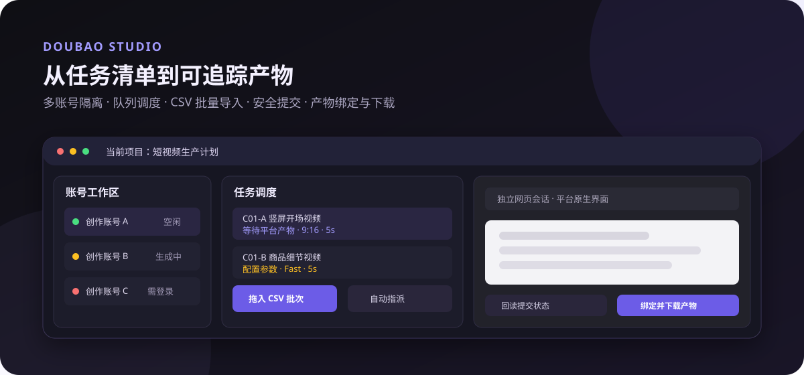
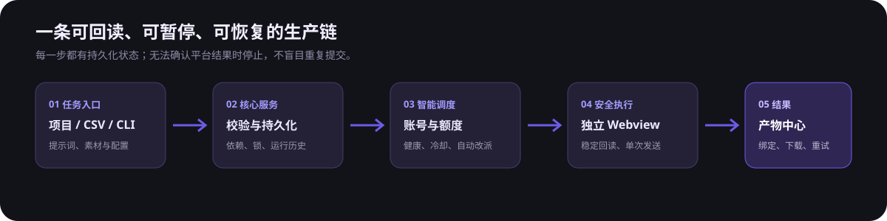
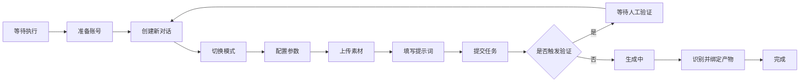
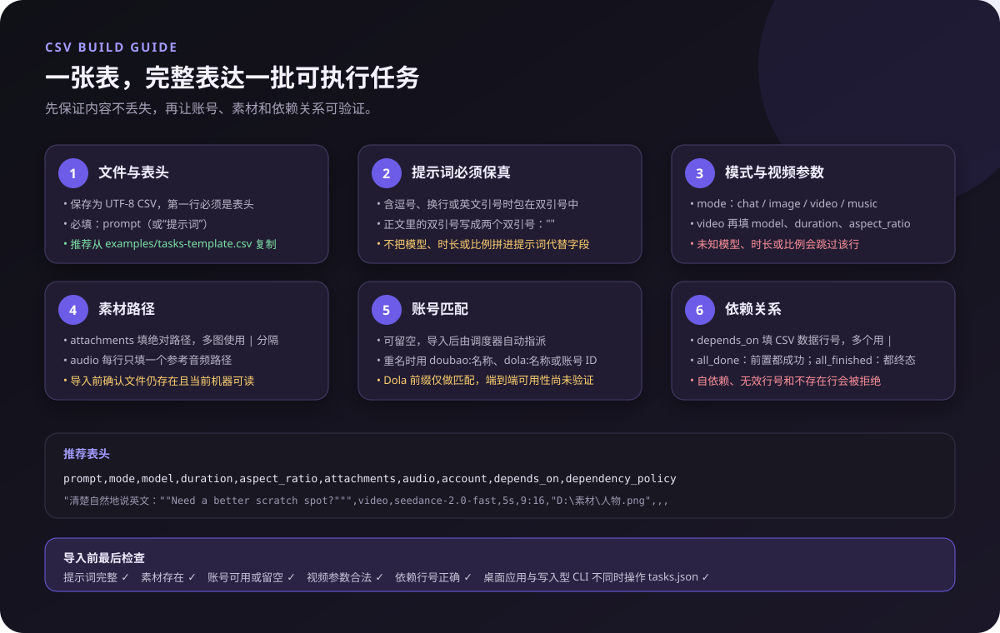

<div align="center">

# 豆包工作室 Doubao Studio

**面向 AI 内容生产团队的 Windows 多账号任务工作台**

把提示词、素材、账号、队列、网页生成、产物绑定与下载，连接成一条可追踪、可暂停、可恢复的生产链。

[](CHANGELOG.md)
[](https://github.com/dorakoo/doubao-studio/releases/latest)
[](https://github.com/dorakoo/doubao-studio/actions/workflows/ci.yml)
[](https://www.electronjs.org/)
[](https://react.dev/)
[](https://www.typescriptlang.org/)
[](LICENSE)

[快速开始](#快速开始) · [第一次使用](#第一次使用从登录到下载) · [CSV 批量导入](#csv-批量导入) · [常见问题](#常见问题) · [开发与验证](#开发与验证)

</div>



豆包工作室不会替代豆包网页。它保留平台原生界面和人工处理能力，同时为重复生产增加项目隔离、多账号 Session、任务队列、运行状态、提交门禁、产物管理和恢复机制。适合短视频团队、批量素材生产、多个内容主题或客户项目并行管理。

| 渠道 | 当前状态 |
| --- | --- |
| 当前候选源码 | `2.3.1` 维护线；本机控制面尚待合并、安装包和人工验收 |
| GitHub Release | 以页面显示的 Latest Release 为准；安装包可能晚于 `main` |
| 自动化验收 | `main` 每次推送由 Windows CI 执行统一 `pnpm run validate` |

> [!IMPORTANT]
> 本项目是社区开发的非官方工具，与字节跳动或豆包官方无隶属关系。网页自动化能力会随平台页面变化而需要适配；请遵守平台服务条款、内容规范和所在地法律法规。

## 一眼看懂



| 生产问题 | 豆包工作室的处理方式 |
| --- | --- |
| 多个账号容易串登录状态 | 每个账号使用独立 Electron Session 和独立网页工作区 |
| 批量任务难以追踪 | 项目、批次、任务、运行记录和产物使用稳定 ID 关联 |
| 页面未准备好却被误提交 | 上传、提示词、模型、比例、时长和提交控件逐级回读 |
| 弹窗或人工确认打断自动化 | 识别已知阻断，转为等待人工处理或安全回读，不盲目补点 |
| 额度耗尽后任务一直失败 | 清空当日预测额度，改派健康账号；无替代账号时保持排队 |
| 程序退出后任务状态丢失 | 持久化阶段、心跳、租约与运行历史，启动时执行受控恢复 |
| 产物与任务对不上 | 以任务运行、账号、会话和媒体 ID 绑定，无法证明归属时拒绝误绑 |

## 本轮新增与改进

### 生产连续性

- **启动与 Webview 恢复**：开发端口自动发现，渲染页加载失败可重试；启动时恢复上次前台账号并重建可用网页工作区。
- **账号前台交互租约**：任务配置、上传、提交和结果回读期间锁定对应账号页面。用户切换查看其他账号不会再让执行中的任务失去输入框或控件上下文。
- **调度恢复**：全局暂停后清理遗留锁并重新处理可恢复队列；恢复失败会显示真实阻塞原因。

### 视频提交安全

- **上传连续稳定门禁**：参考素材数量正确、上传进度消失且页面连续稳定后才进入下一步。
- **控件连续稳定门禁**：模型、时长、比例和提交控件都必须可见并连续回读一致，避免页面慢加载时误判。
- **提交意图先持久化**：发送前记录提交意图；发送后以平台页面回读为准。结果不确定时停止，禁止对同一任务高频重发。
- **素材授权弹窗接管**：人工确认可能直接触发平台提交时，工作室只进行状态回读和产物跟踪，不再次点击发送。
- **推广弹窗白名单处理**：只自动关闭已识别的“下载电脑版 / 使用完整功能”推广弹窗，优先点击“下次提醒我”；登录、人机验证、额度、素材授权和未知弹窗一律不误关。

### 批量生产与额度

- **CSV 拖放导入**：把一个 `.csv` 文件拖到任务调度区即可导入，导入摘要会列出成功、跳过和未指派任务。
- **CSV CLI 导入**：无桌面操作时，可通过唯一显式写入命令复用 `TaskService.importCsv()`；文件在导入期间漂移会 fail-closed。
- **额度感知调度**：默认按每个账号每天 6 个免费额度单位、每 5 秒视频 1 单位估算；平台明确提示耗尽后立即把当日预测剩余归零并安全改派。
- **自然日刷新**：按运行机器本地时区每日 00:00 刷新预测额度并重新处理等待队列。
- **Dola 兼容边界**：账号、Session 和调度模型不写死显示名称；实际页面能力仍需通过兼容性自检，未确认控件时保持 fail-closed。

> [!WARNING]
> **Dola 当前尚未验证可用性。** 现阶段只完成账号平台字段、独立 Session/URL 边界和 CSV 中 `dola:账号名` 的匹配支持；真实登录、对话/图片/视频提交、生成等待、产物绑定与下载尚未完成端到端人工验收。请勿把 Dola 标记理解为生产可用承诺。

### 交互体验

- **分隔条性能优化**：拖拽采用帧级合并更新，减少账号列表、任务区和网页区调整宽高时的卡顿。
- **跨 Webview 松手识别**：拖拽进入网页区域后松开鼠标也能结束调整，不必再把指针拖到系统桌面。
- **账号处理提醒**：登录失效、人机验证或页面异常只阻断对应账号，并在界面保留明确提醒。

### 平台与 Agent 接入

- **Core 服务收敛**：任务创建、编辑、状态、锁、恢复、CSV 导入、产物校验和查询通过统一服务边界处理，Repository 写入失败 fail-closed。
- **Capability API Schema v1**：用版本化 Schema 描述任务、事件、产物和结构化错误，不暴露 Cookie、DOM 或本地绝对路径。
- **CLI / MCP 双边界**：CLI 提供只读查询和受控 CSV 导入；MCP 服务端暴露只读任务工具，MCP 客户端支持显式连接、secret 脱敏和调用审计。

## 核心能力

### 项目化工作空间

- 顶部项目切换器用于创建和切换项目。
- 旧版本任务自动迁移到“默认项目”。
- 任务列表、CSV 批次和产物中心按当前项目隔离。
- 项目概览显示完成率、任务数、批次数和历史产物。
- 支持导出不含网页登录信息和远程产物地址的项目包。

### 多账号工作区

- 每个账号使用独立 Electron Session，隔离 Cookie、登录状态和网页存储。
- 支持账号置顶、搜索、刷新、运行状态和健康状态展示。
- 根据任务负载、连续失败、冷却状态和 Seedance 预测额度智能分配账号。
- 检测额度耗尽、人工验证和登录异常后自动降低账号调度优先级。
- 支持暂停账号调度和手动冷却 30 分钟。
- 不可用账号上的排队任务可迁移到其他健康账号。

### 多模式任务生产

- 支持对话、图片、视频和音乐任务。
- 视频任务支持 Seedance 2.0、Fast、Mini，及常用画面比例和时长。
- 支持多张参考图片、参考音频和完整配置编辑重跑。
- 每次启动或重跑任务前创建新对话，减少不同任务之间的上下文污染。
- 可保存完整任务模板，复用提示词、模式、素材和视频配置。

### 批量变量

提示词中可以使用 `{{变量名}}`，变量区每行表示一组任务：

```text
一支 {{产品}} 放在 {{场景}}，电影感产品广告，柔和自然光
```

```text
产品=保温杯;场景=客厅
产品=咖啡杯;场景=办公室
```

添加后会生成两条独立任务。多个基础提示词仍可使用 `%%%%%%%%%%` 分隔。

### 可恢复自动化

任务不再只有简单的“运行中”。系统会持久化以下阶段：


```mermaid
flowchart LR
    A[等待执行] --> B[准备账号]
    B --> C[创建新对话]
    C --> D[切换模式]
    D --> E[配置参数]
    E --> F[上传素材]
    F --> G[填写提示词]
    G --> H[提交任务]
    H --> I{是否触发验证}
    I -- 是 --> J[等待人工验证]
    J --> C
    I -- 否 --> K[生成中]
    K --> L[识别并绑定产物]
    L --> M[完成]
```

- 保存运行 ID、输入快照、运行次数、当前阶段、阶段说明和心跳时间。
- 可立即暂停长时间视频等待，不必等到超时。
- 程序意外退出后，未完成任务会恢复为“已暂停”，可重新执行。
- 人工验证完成后会重新创建对话、上传素材并再次提交。
- 对额度、会员、人脸素材、审核、网络、页面变化和产物缺失进行分类记录。
- 主进程使用原子任务锁，阻止重复点击、热更新和竞态造成重复执行。
- 最近 20 次运行记录保留结果、错误类型和实际耗时。

### 视频生成与长时长门禁

- 自动确认模型、比例和时长，减少下拉菜单选择失败。
- 11–15 秒只在当前账号页面真实显示对应可选控件时继续；无法确认或出现会员窗口时在提交前停止。
- 历史“请求改写”入口已永久禁用，不修改平台请求、不绕过会员、额度或风控限制。
- 视频生成可以长时间等待，同时支持随时暂停和手动提取。
- 识别明确的额度不足、会员限制、人脸限制和生成失败提示，停止无意义等待。

> 可选时长以豆包当前页面和账号权益为准。任务配置允许表达 4–15 秒，但实时门禁有权拒绝当前页面无法证明可用的配置。

### 产物与下载

- 产物绑定任务运行 ID、账号、豆包对话地址、发现时间和来源。
- 重新运行不会删除历史产物记录。
- 手动提取旧任务时，会先打开该任务对应的豆包对话，避免抓取其他任务的视频。
- 下载任务保留完成状态、文件大小、失败原因和保存位置。
- 下载失败项可以在“下载记录”中重试。
- 视频原始地址提取采用多通道候选检测，但不保证任何时候都能获得无水印版本。

### 产物中心

- 汇总所有任务历次运行产生的图片、视频和文件。
- 按提示词、任务 ID、类型和地址有效性筛选。
- 对远程地址执行轻量有效性检测，区分有效、过期和不可用。
- 显示产物是否已经下载到本地。
- 支持预览、重新下载和返回产物对应的豆包对话。

### 视频产物解析与下载增强

- 视频产物解析支持多策略回退：捕获响应、播放信息、平台下载信息、对话结构化扫描和页面回退。
- 对话扫描发现新视频 ID 后，会在剩余等待预算内回补 API 查询，减少“页面已生成但未找到产物”的情况。
- 候选产物按任务会话和视频 ID 进行绑定，无法证明归属时不会误绑定旧视频，并支持手动提取兜底。
- 自动解析和手动提取均支持取消；下载前校验 HTTP 状态、响应内容和媒体类型，并对常见失败原因分类提示。
- 原始地址与普通播放地址分开标记，不把普通播放地址误报为无水印原始文件。

### CSV 批量导入



- 从 CSV 批量导入提示词、模式、视频模型、时长、比例、素材和账号。
- 可点击 CSV 按钮选择文件，也可把单个 `.csv` 文件直接拖到任务调度区；导入结果会明确显示成功、跳过和未指派数量。
- 使用 `depends_on` 指定前置 CSV 行号，多个行号使用 `|` 分隔。
- `all_done` 要求所有前置任务成功；`all_finished` 允许前置任务失败后继续。
- 任务批次页面汇总总数、进度、运行、排队和失败数量。
- 可对整个批次中的失败任务一键重新排队。

CSV 模板见 [`examples/tasks-template.csv`](examples/tasks-template.csv)。

常用字段如下；实际表头以模板为准，未识别字段不会被猜测为平台参数：

| 字段 | 用途 | 示例 |
| --- | --- | --- |
| `prompt` | 完整提示词；保留换行、英文引号和正文 | `生成一段 9:16 商品视频…` |
| `mode` | 任务模式 | `video` |
| `account` | 账号显示名称；找不到时保持未指派 | `创作账号 A` |
| `model` | 页面中需要选择的视频模型 | `Seedance 2.0 Fast` |
| `duration` | 视频时长（秒） | `5` |
| `ratio` | 画面比例 | `9:16` |
| `reference_images` | 参考图片绝对路径；多值按模板规则填写 | `D:\assets\hero.png` |
| `depends_on` | 前置 CSV 行号，多个使用 `|` 分隔 | `1|2` |
| `dependency_policy` | `all_done` 或 `all_finished` | `all_done` |

> [!CAUTION]
> `import-csv` CLI 会写入项目和任务数据。必须先退出豆包工作室，再显式提供真实 `tasks.json` 与同目录 `projects.json`；不要让桌面程序与 CLI 同时写同一数据文件，也不要猜测历史工作树中的数据路径。`--project-id` 必须是真实 ID；如需新项目，使用 `--project-name` 创建，不要把项目名称填入 `--project-id`。

### 页面适配系统

- 当前适配器和规则包具有独立版本号。
- 兼容性自检检查输入框、提交控件、视频入口、模型、时长、比例、上传和产物识别。
- 自检报告脱敏保存在本地，最多保留最近 50 份。
- 支持导入受限 JSON 规则包，不执行规则包中的脚本。
- 新规则安装前保存旧版本，可通过工具栏一键回退。

适配规则示例见 [`examples/adapter-rules.json`](examples/adapter-rules.json)。

### 日志、备份与发布

- 运行日志按信息、警告和错误分级，支持任务和错误关键词搜索。
- 完整备份包含项目、账号配置、任务、下载、诊断、日志和应用设置，不包含 Cookie。
- 支持备份恢复与 JSON 数据完整性检查。
- 应用内可查询 GitHub 最新 Release。
- GitHub Actions 自动执行类型检查、构建和 Windows 标签发布。

### Agent 能力协议与平台化接口

- 新增 Capability API Schema v1，统一描述能力清单、异步任务、任务事件、产物和结构化错误。
- 为未来的 Agent、CLI 和 MCP 接入定义稳定边界，外部调用可围绕不透明的 `taskId`、`requestId`、事件序号和 `artifactId` 进行集成。
- `requestId` 支持当前服务进程内幂等；响应丢失时可按 requestId 查询任务，避免盲目重复提交。
- 公共协议不暴露 Cookie、Session、Webview、DOM、Zustand、豆包内部 URL 或本地绝对路径。
- v1 Schema 使用开放字符串枚举，客户端应忽略无法识别的新状态，为后续能力扩展保留兼容性。
- Schema 文件位于 `schemas/capability/v1/`，设计说明见 [`docs/architecture/capability-api-schema.md`](docs/architecture/capability-api-schema.md)。

### CLI 与 MCP 边界（v2.3）

- CLI 的 `list / task / outputs / diagnostics` 保持只读；写入面仅有 `import-csv` 和冻结范围的一次性项目迁移。
- `import-csv` 必须提供 `--csv`、真实 `--tasks-file` 与可推导/显式 `--projects-file`。使用 `--project-id <真实ID>` 导入现有项目，或使用互斥的 `--project-name <名称>` 创建新 UUID 后导入；同名项目不会自动合并。未知 ID 返回 `PROJECT_NOT_FOUND`，任务台账不变。
- 示例：`pnpm run cli:import -- --csv "D:\\batch.csv" --tasks-file "C:\\...\\DoubaoStudioData\\tasks.json" --projects-file "C:\\...\\DoubaoStudioData\\projects.json" --project-id "<项目ID>"`。
- CLI 只输出导入数、跳过数、项目 ID、批次 ID 和错误摘要，不回显提示词或素材绝对路径。项目和任务文件在读取后漂移均 fail-closed，桌面程序运行时禁止调用写入 CLI。
- MCP 服务端（`pnpm run mcp:server`）：JSON-RPC 2.0 over stdio，暴露 `doubao.list_tasks` / `doubao.get_task` 两个只读工具；由外部 MCP 客户端（如 Claude Desktop、Alice-agent 生态）接入。
- MCP 客户端（`pnpm run mcp:client`）：stdio 客户端核心（initialize / tools/list / tools/call / ping），支持 `tools / call / audit` 三个只读命令：
  - 连接配置来自用户显式提供的 JSON 文件（`--connections-file`），**无内置连接、不自动连接任何服务**。
  - `env` 中的 secret 键（`TOKEN/KEY/SECRET/PASSWORD` 命名规则或显式 `secretKeys`）在展示与日志中一律脱敏为 `***`。
  - `call` 是用户显式触发的唯一调用路径，每次调用追加一条脱敏审计记录（连接名/工具名/结果，不含参数值与环境变量）。
  - 客户端已与 Alice-agent 只读 MCP 服务端（`agent.health` / `agent.organizations_list` / `agent.billing_usage` / `agent.billing_invoices`）完成生产接线验证。
- 边界纪律：CLI/MCP 相关源码零 `electron` import，可独立于桌面应用运行与测试。

### 正式运行实例的本机控制面

- 默认关闭；使用 `豆包工作室.exe --local-control` 显式开启，或附加 `--local-control-port=<端口>` 固定端口。
- 只监听 `127.0.0.1`，每次启动生成短期 Bearer 令牌；发现信息与令牌分文件存放，退出即删除，令牌不进入日志。
- Agent 通过项目 ID、批次 ID、任务 ID 调用 `start / pause / cancel / retry`，主进程和 Renderer 双重校验归属后复用正式调度链。
- 响应不包含完整提示词、素材绝对路径、产物/会话 URL、Cookie、Token 或账号 Session，也不提供 DOM/CDP 和任意脚本执行。
- 端点、发现文件和调用示例见 [`docs/LOCAL_CONTROL.md`](docs/LOCAL_CONTROL.md)。现有离线 CLI/MCP 后续可迁移为该控制面的客户端。

## 界面结构

- **顶部工具栏**：全部暂停/继续、批量下载、下载记录、运行统计、诊断导出和设置。
- **账号列表**：账号切换、健康状态、Seedance 额度预测和运行详情。
- **任务调度区**：添加、编辑、指派、启动、暂停、重跑、产物提取和批量下载。
- **网页工作区**：显示每个账号独立的豆包网页，可在自动化外继续手动操作。

## 快速开始

### 环境要求

- Windows 10/11 x64
- Node.js 24（使用 pnpm 11 时推荐）
- pnpm 9 或更高版本
- 可正常访问豆包网页的网络环境
- 每个账号需在独立网页工作区中自行完成登录

### 从源码启动

```bash
git clone https://github.com/dorakoo/doubao-studio.git
cd doubao-studio
pnpm install
pnpm run dev
```

开发启动器会优先使用 `5173`。端口被占用时会自动选择后续空闲端口，并让 Electron 加载正确地址。

若使用 GitHub Release 安装包，直接安装并启动即可。源码版和安装版可能解析到同一个 Electron 用户数据目录：切换版本前先在“更多”中创建完整备份，并确保任何时刻只运行一个豆包工作室实例。

## 第一次使用：从登录到下载

1. **添加账号**：点击账号列表右上角的 `+`，填写只用于本地识别的名称。
2. **完成登录**：切换到该账号，在右侧独立网页中手动登录。每个账号的 Cookie 和网页存储彼此隔离。
3. **检查可用性**：确认账号状态不是“需登录”“需要验证”或“冷却中”。豆包页面更新后，先从“更多”运行兼容性自检。
4. **建立项目**：从顶部项目切换器创建项目；任务、批次、历史和产物都会归入当前项目。
5. **添加任务**：选择对话、图片、视频或音乐模式。视频任务还需设置模型、时长、比例和参考素材。
6. **核对提示词**：普通批量可用 `%%%%%%%%%%` 分隔，也可使用变量区；生产批次建议使用 CSV，避免人工复制遗漏长提示词或英文引号。
7. **选择账号**：开启自动指派，或为任务指定一个已登录且额度可用的账号。
8. **启动并观察**：任务详情会显示创建对话、配置参数、上传、填写、发送、等待回复和绑定产物等阶段。执行期间可以查看其他账号，系统会保护任务使用的前台网页。
9. **处理人工阻断**：人机验证、登录、素材授权或未知弹窗出现时，按界面提示人工处理。不要连续点击发送；工作室会在弹窗消失后回读是否已经提交。
10. **验收产物**：任务完成后检查预览、运行历史和产物归属。视频任务应核对模型、比例、时长和内容是否符合输入。
11. **下载与归档**：从任务或产物中心下载；失败下载可在下载记录中重试。手动在网页中生成的视频可用浏览器工具栏“提取当前对话视频”。

### 三种批量导入方式

| 场景 | 推荐入口 | 说明 |
| --- | --- | --- |
| 正在使用桌面应用 | CSV 按钮 | 选择一个 `.csv` 文件并查看导入摘要 |
| 正在使用桌面应用 | 拖放 CSV | 把一个 `.csv` 文件拖到任务调度区，松手后直接导入 |
| 无桌面控制、由 Agent 导入 | CLI | 先退出桌面应用，再显式指定数据文件 |

```powershell
pnpm run build:main
pnpm run cli:import -- --csv "D:\batch.csv" --tasks-file "C:\Users\<你>\AppData\Roaming\<应用数据目录>\DoubaoStudioData\tasks.json" --projects-file "C:\Users\<你>\AppData\Roaming\<应用数据目录>\DoubaoStudioData\projects.json" --project-id "<项目ID>" --accounts-file "C:\Users\<你>\AppData\Roaming\<应用数据目录>\DoubaoStudioData\accounts.json"
```

CLI 只创建本地任务，不会自动提交到豆包；导入后的任务仍需经过账号健康、额度、依赖和提交门禁。

## 开发与验证

项目的本地与 CI 统一门禁是 `pnpm run validate`，依次执行类型检查、ESLint、工程边界检查、单元测试和双端构建。

| 命令 | 用途 |
| --- | --- |
| `pnpm run dev` | 启动 Vite 与 Electron 开发环境 |
| `pnpm run validate` | 执行完整本地/CI 门禁 |
| `pnpm run ts-check` | 检查主进程和渲染进程类型 |
| `pnpm run test` | 单次运行全部 Vitest 测试 |
| `pnpm run build` | 构建前端与 Electron 主进程 |
| `pnpm run dist:win` | 生成 Windows 安装包 |
| `pnpm run pack` | 生成未安装的打包目录 |
| `pnpm run cli:list` | 只读 CLI：列出任务 |
| `pnpm run cli:import -- --csv <csv> --tasks-file <tasks.json> --project-id <id>` | 显式写入 CLI：校验项目后通过 TaskService 导入 CSV；桌面程序运行时禁用 |
| `pnpm run cli:migrate-project -- ...` | 冻结范围项目迁移；默认 dry-run，只有显式确认与全部不变量通过才写入 |
| `pnpm run mcp:server` | 启动 MCP stdio 服务端（只读工具） |
| `pnpm run mcp:client` | 启动 MCP 客户端 CLI（`tools` / `call` / `audit`） |

## 数据与隐私

- 账号会话由 Electron 按账号分区存储，不会提交到 Git。
- 任务、账号状态和下载记录保存在 Electron 用户数据目录的 `DoubaoStudioData` 中。
- JSON 数据采用临时文件写入，并保留 `.bak` 备份供损坏时恢复。
- 诊断包会隐藏提示词正文、完整素材路径和产物 URL。
- 请勿在 Issue、日志或截图中公开 Cookie、Token、个人账号信息或私有素材。

## 常见问题

### `Port 5173 is already in use`

新版 `pnpm run dev` 会自动选择空闲端口。若仍看到旧错误，请确认代码已更新，并关闭旧版本遗留的开发进程。

### 视频一直等待

视频可能仍在生成，也可能被额度、会员、人脸或审核提示阻断。新版会检测常见阻断信息；也可直接暂停任务，稍后通过“提取视频”重新检查对应对话。

### 任务调度暂停后没有继续

点击顶部的继续按钮。系统会释放暂停前遗留的运行锁并将可恢复任务重新加入队列；若仍有任务不能恢复，会提示账号额度、登录、验证、冷却或依赖关系等阻塞原因。

### 手动生成的视频如何下载

保持该视频所在的豆包对话为当前页面，点击浏览器工具栏中“提取当前对话视频”的下载图标。系统会在当前会话内解析并下载视频，同时以预测值更新该账号的 Seedance 额度。平台未提供可用原始地址时会显示失败原因。

### 机器人验证完成后任务没有生成

保持任务处于“等待验证”，手动完成验证。系统检测验证消失后会重新建立对话、恢复素材和配置并再次提交。

### 下载到错误的视频

优先从任务详情进入“提取视频”。新版会根据保存的对话地址返回原任务页面，再绑定发现的产物。

### 豆包更新后按钮识别失效

网页自动化依赖豆包当前 DOM 和交互结构。请导出脱敏诊断包，并在 [Issues](https://github.com/dorakoo/doubao-studio/issues) 中附上现象、阶段和相关日志。

## 项目结构

```text
main/core/                  TaskService、Repository 与任务事件流
main/ipc/                   Electron IPC 薄适配和系统能力
main/cli/                   只读查询与受控 CSV 导入 CLI
main/mcp/                   MCP stdio 服务端和客户端
main/utils/                 持久化、启动、额度和媒体辅助逻辑
packages/contracts/         主进程与渲染进程共享的纯类型契约
schemas/capability/v1/      对外任务、事件、产物与错误 Schema
src/components/             账号、任务、浏览器、下载和设置界面
src/automation/             执行协调器、任务锁和页面适配规则
src/store/                  Zustand 界面投影与调度状态
src/utils/doubaoBridge.ts   豆包网页交互与产物提取适配层
tests/unit/                 Core、IPC、调度和页面适配行为测试
examples/                   CSV 模板和受限适配规则示例
docs/                       架构设计、交接证据和 README 图文资产
```

## 参与开发

完整流程见 [CONTRIBUTING.md](CONTRIBUTING.md)，安全问题见 [SECURITY.md](SECURITY.md)。最基本的要求是：

1. Fork 本仓库并从 `main` 创建功能分支。
2. 保持修改聚焦，避免提交账号数据、构建产物、诊断包和生成视频。
3. 提交前运行完整的 `pnpm run validate`。
4. 对豆包页面适配的修改，请说明页面模式、模型、比例、复现步骤和是否执行真实平台写入。

## 路线图

- 继续将账号、调度和产物领域收敛到 Core。
- 拆分页面适配巨型模块并冻结 ProviderAdapter 契约。
- 为 CSV 增加可视化字段映射和导入前检查。
- 在认证、单实例和审计模型明确后，再评估本地 API 与事件订阅。
- 完成源码版本、人工验收、安装包和 GitHub Release 的独立收口。

完整阶段状态见 [ROADMAP.md](ROADMAP.md)，版本变化见 [CHANGELOG.md](CHANGELOG.md)。

## License

本项目使用 [MIT License](LICENSE)。
